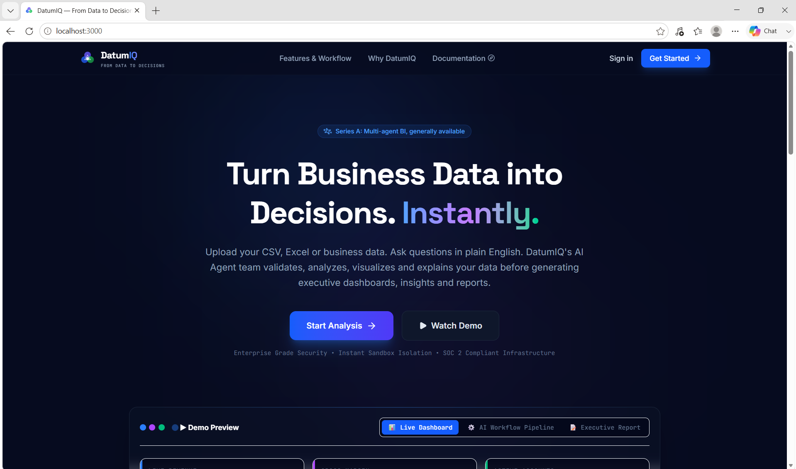
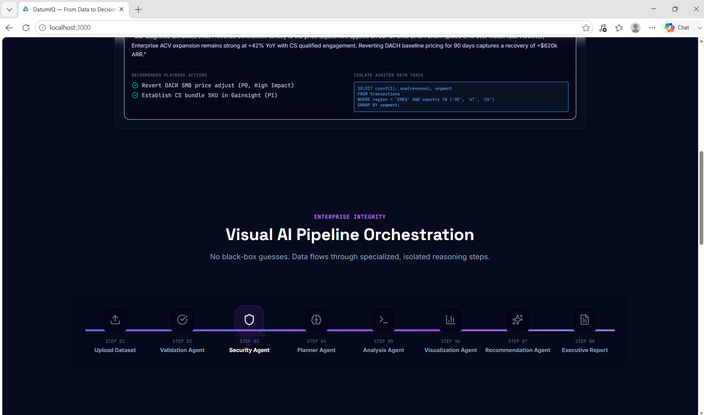
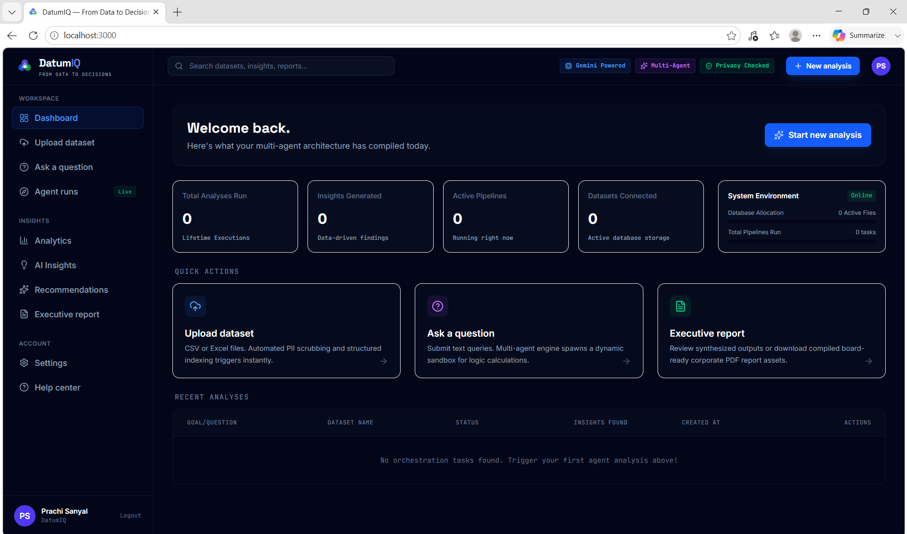
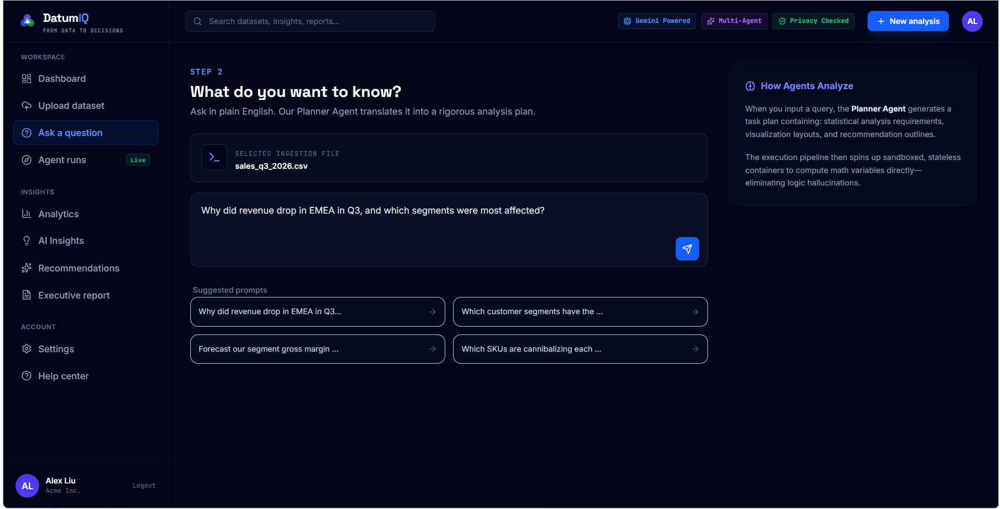
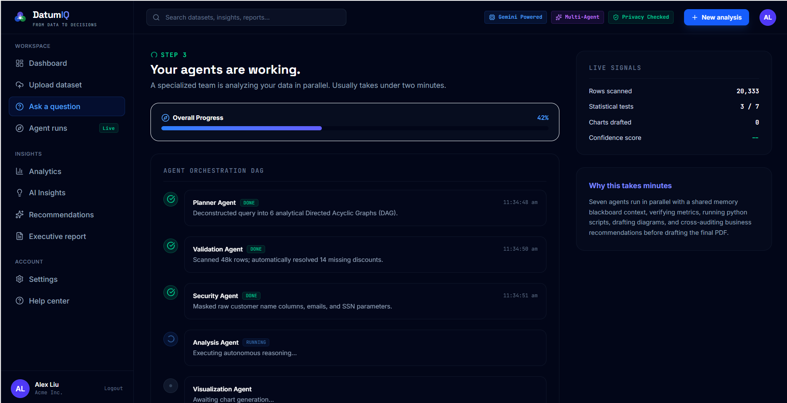
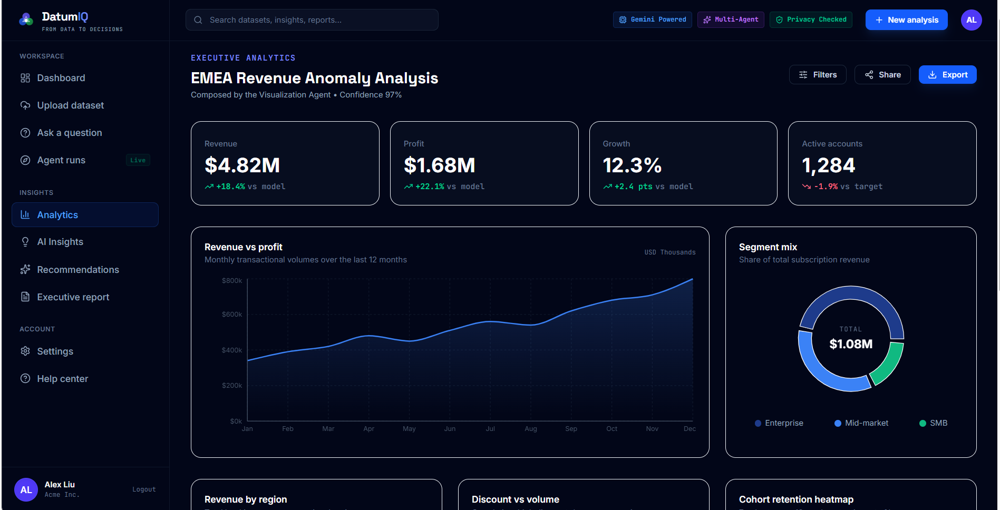
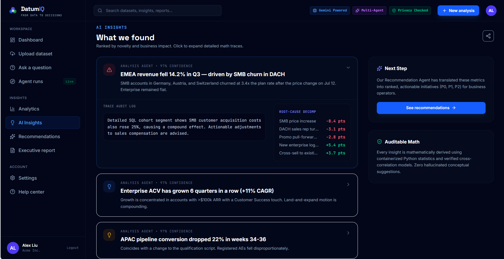
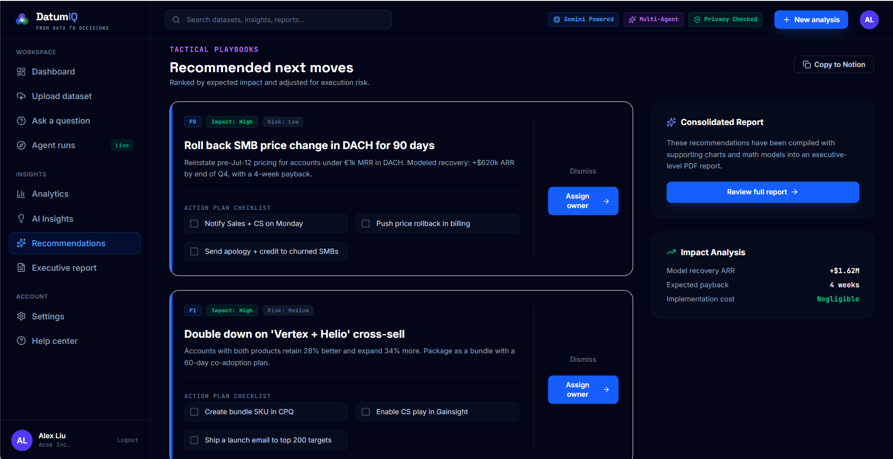
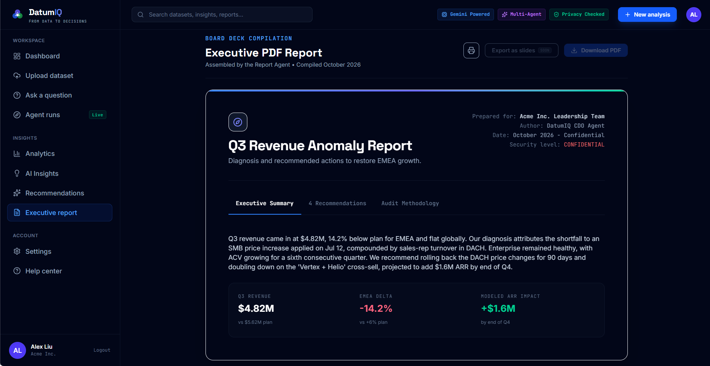

# 🚀 DatumIQ — AI Chief Data Officer

> **From Data to Decisions.**

DatumIQ is an AI-powered Decision Intelligence Platform that transforms raw business datasets into meaningful insights, interactive visualizations, strategic recommendations, and executive reports using a collaborative Multi-Agent AI architecture.

Built as a capstone project for the **Kaggle × Google AI Intensive Course**, DatumIQ aims to help business owners and decision-makers make faster, smarter, and data-driven decisions without requiring technical expertise.

---

## 📸 Project Preview

### Landing Page

<p align="center">

</p>

---

### AI Multi-Agent Workflow

<p align="center">

</p>

---

### Analytics Dashboard

<p align="center">

</p>

---
### Uploading Dataset

<p align="center">

</p>

---
### Agents in Process

<p align="center">

</p>

---
### Visualization

<p align="center">

</p>

---
### Insights

<p align="center">

</p>

---
### Recommendations

<p align="center">

</p>

---
### Report

<p align="center">

</p>

---

# ✨ Features

- 🔐 Secure User Authentication
- 📂 CSV & Excel Dataset Upload
- 🤖 Multi-Agent AI Orchestration
- 📊 Automatic Data Analysis
- 📈 Interactive Visualizations
- 💡 AI-generated Business Insights
- 🎯 Strategic Recommendations
- 📄 Executive PDF Report Generation
- 📱 Responsive Modern UI
- ⚡ End-to-End Analysis Pipeline

---

# 🧠 AI Multi-Agent Architecture

DatumIQ follows a collaborative AI Agent architecture where every agent has a dedicated responsibility.

```
User Upload
      │
      ▼
Validation Agent
      │
      ▼
Security Agent
      │
      ▼
Planner Agent
      │
      ▼
Analysis Agent
      │
      ▼
Visualization Agent
      │
      ▼
Insights Agent
      │
      ▼
Recommendation Agent
      │
      ▼
Report Agent
      │
      ▼
Executive Decision Report
```

Each agent contributes independently before passing the results to the next stage, producing explainable and structured business intelligence.

---

# 🏗 Project Architecture

```
Frontend (React + TypeScript)
          │
          ▼
FastAPI Backend
          │
          ▼
AI Orchestrator
          │
 ┌────────┼────────┐
 │        │        │
Validation Security Planner
 │
Analysis
 │
Visualization
 │
Insights
 │
Recommendations
 │
Report Generator
          │
          ▼
Dashboard + PDF Report
```

---

# 🛠 Tech Stack

## Frontend

- React
- TypeScript
- Tailwind CSS
- Vite
- Recharts
- Lucide Icons

---

## Backend

- Python
- FastAPI
- SQLAlchemy
- SQLite
- Pandas
- NumPy

---

## AI

- Google Gemini API
- Multi-Agent Architecture
- Prompt Engineering
- AI Orchestration Pipeline

---

## Security

- JWT Authentication
- Password Hashing
- PII Detection
- Data Validation
- Secure File Upload

---

# 📂 Folder Structure

```
frontend/
backend/
agents/
models/
routers/
reports/
database/
uploads/
```

---

# ⚙️ Workflow

1. User signs in.
2. Uploads a CSV or Excel dataset.
3. Validation Agent checks data quality.
4. Security Agent detects sensitive information.
5. Planner Agent understands the user's business question.
6. Analysis Agent performs statistical analysis.
7. Visualization Agent generates relevant charts.
8. Insights Agent extracts key findings.
9. Recommendation Agent suggests business actions.
10. Report Agent generates a comprehensive executive report.

---

# 📊 Example Questions

- Which region has the highest sales?
- What products are most profitable?
- Why is revenue decreasing?
- Show customer purchase trends.
- Which category should receive more investment?
- Generate an executive summary.

---

# 🎯 Project Goals

DatumIQ was designed to bridge the gap between raw business data and strategic decision-making by providing:

- Explainable AI
- Faster business insights
- Automated reporting
- Decision support
- Interactive analytics

---

# 🚀 Future Roadmap

- AI Chat with datasets
- Predictive analytics & forecasting
- Multi-file analysis
- Team collaboration
- Role-based dashboards
- Cloud deployment
- Real-time streaming analytics
- Database connectors (MySQL, PostgreSQL, Snowflake)
- Power BI integration
- Enterprise security enhancements

---

# 👩‍💻 Developed By

**Prachi Sanyal**

Final Year BCA Student

Built as part of the **Kaggle × Google AI Intensive Course Capstone Project**.

---

# ⭐ If you like this project

Give it a ⭐ on GitHub!
